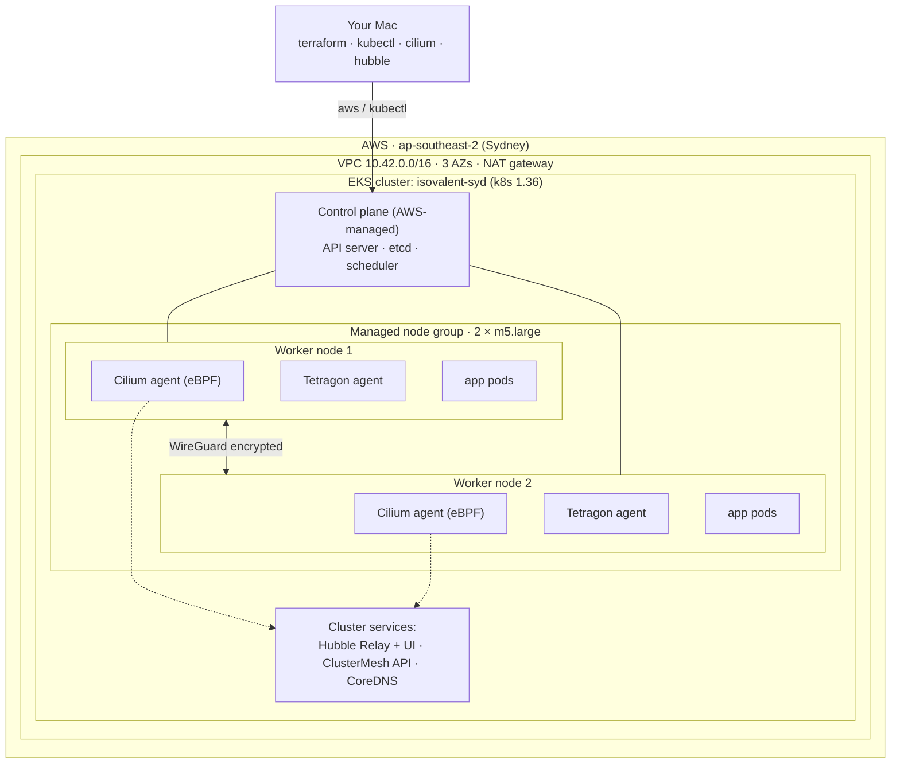
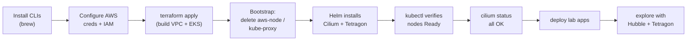

# FULL DEPLOYMENT — End-to-End, Step by Step

This is the complete, manual walkthrough for standing up an **Amazon EKS** cluster in
**Sydney (`ap-southeast-2`)** running the **Isovalent Enterprise stack** — **Cilium**
replacing the AWS VPC CNI, **Tetragon** for runtime security, **Hubble** for observability,
**WireGuard** encryption, and **ClusterMesh** ready to pair — then deploying lab apps on top.

It is written as if you are sitting at a fresh macOS laptop and typing every command
yourself. Every step includes the command, what to expect, and how to recover when it
goes wrong. **Every real-world error encountered during the original build is captured in
the [Troubleshooting](#10-troubleshooting--real-world-errors-and-fixes) section** — read it,
because you will probably hit at least one of them.

> Conventions
> - `$` lines are commands you type.
> - Replace anything in `<ANGLE_BRACKETS>` with your own value.
> - **Never paste real AWS keys into chats, tickets, or commits.** Use `aws configure`.

> **Course map:** [Part 0 · Orientation](README.md) → **Part 1 · Build & Verify (this page)** → [Part 2 · Operate & Explore](ISOVALENT_FEATURES.md)
>
> You are in **Part 1**. Finish this page end-to-end — by the last section you'll have a
> running, verified cluster — then move on to Part 2 for the hands-on feature labs.

---

## How to use this guide

This document is written to be **read in order the first time**, then used as a reference
afterwards. If you are new to Kubernetes or to Cilium, **do not skip [Section 0](#0-concepts-you-need-first)** —
every later step assumes the vocabulary and mental model it builds. Each major section opens
with a short *"What you'll learn"* box and closes with a *"Check yourself"* box so you can
confirm you actually understood it before moving on.

Three documents make up the full course (always read them in this order):

| Part | Document | Purpose | Read it when |
|------|----------|---------|-------------|
| 0 | [`README.md`](README.md) | Big-picture orientation, topology and repo map. | First, for context. |
| **1** | **`FULL_DEPLOYMENT.md`** (this file) | Build the cluster from a blank laptop to a running, verified stack. | **Now** — start to finish. |
| 2 | [`ISOVALENT_FEATURES.md`](ISOVALENT_FEATURES.md) | Hands-on labs for every Cilium / Hubble / Tetragon feature. | After this cluster is up and verified. |

## Table of contents

0. [Concepts you need first](#0-concepts-you-need-first)
1. [Prerequisites and tool installation](#1-prerequisites-and-tool-installation)
2. [AWS account and IAM preparation](#2-aws-account-and-iam-preparation)
3. [Configure AWS credentials locally](#3-configure-aws-credentials-locally)
4. [Get the code](#4-get-the-code)
5. [Understand what Terraform will build](#5-understand-what-terraform-will-build)
6. [Initialize, plan, apply](#6-initialize-plan-apply)
7. [Connect kubectl and verify the cluster](#7-connect-kubectl-and-verify-the-cluster)
8. [Verify the Isovalent stack](#8-verify-the-isovalent-stack)
9. [Deploy and exercise the lab apps](#9-deploy-and-exercise-the-lab-apps)
10. [Troubleshooting — real-world errors and fixes](#10-troubleshooting--real-world-errors-and-fixes)
11. [Teardown](#11-teardown)
12. [Security checklist](#12-security-checklist)
13. [Cost — what this lab actually bills](#13-cost--what-this-lab-actually-bills)
14. [Glossary](#14-glossary)

---

## 0. Concepts you need first

> **What you'll learn:** the handful of ideas that make every later command make sense —
> what EKS and Kubernetes actually are, what a CNI does, why eBPF matters, and how Cilium,
> Hubble and Tetragon fit together. Spend ten minutes here and the rest of the guide reads
> like plain English.

### 0.1 The 30-second summary

You are going to use **Terraform** (infrastructure-as-code) to ask **AWS** to build a
**Kubernetes** cluster using the **EKS** managed service. Normally EKS wires up pod
networking with the **AWS VPC CNI**. We rip that out and put **Cilium** in its place, because
Cilium is built on **eBPF** and gives us networking, security policy, encryption and deep
observability from one component. We then run two small demo apps on top and use
**Hubble** (network visibility) and **Tetragon** (runtime/process visibility) to see and
control what they do.

### 0.2 The layers, from the metal up

This is the **canonical topology** for the whole course — the same diagram is in
[README › Architecture](README.md#architecture). Both worker nodes are identical: each runs a
**Cilium agent** and a **Tetragon agent** (DaemonSets — one pod per node). Hubble, ClusterMesh
and CoreDNS run once per cluster.



Read it top-down: **AWS** holds a **VPC** (a private network); inside it the **EKS control
plane** is the brain Kubernetes runs on; **worker nodes** are ordinary EC2 virtual machines
where your containers actually run; and on every node sits a **Cilium agent** and a
**Tetragon agent**.

### 0.3 The vocabulary, defined once

| Term | Plain-English meaning | Why you care here |
|------|----------------------|-------------------|
| **AWS** | Amazon's public cloud — you rent servers, networks and services by the hour. | Everything runs here; you pay while it's up. |
| **Region** | A geographic cluster of AWS data centres (`ap-southeast-2` = Sydney). | Lower latency for AU users; keeps data in-country. |
| **VPC** | Virtual Private Cloud — your own isolated network inside AWS. | Your nodes and pods get IPs from it (`10.42.0.0/16`). |
| **EC2 instance** | A virtual machine you rent. `m5.large` = 2 vCPU, 8 GB RAM. | Your Kubernetes *worker nodes* are EC2 instances. |
| **Kubernetes (k8s)** | An orchestrator that schedules and heals containers across many machines. | The platform everything else plugs into. |
| **EKS** | AWS's *managed* Kubernetes — AWS runs the control plane for you. | You don't babysit etcd/API server; you just use them. |
| **Control plane** | The Kubernetes "brain": API server, scheduler, etcd database. | You talk to it with `kubectl`; AWS keeps it alive. |
| **Node** | A worker machine that runs your pods. | This lab has 2. The Cilium/Tetragon agents run one-per-node. |
| **Pod** | The smallest deployable unit — one or more containers sharing an IP. | Your apps run as pods. |
| **Container** | A packaged process with its own filesystem, isolated from the host. | What's actually inside a pod. |
| **Namespace** | A logical folder that groups pods/services (`kube-system`, `boutique`, `default`). | Why `kubectl get pods` looks "empty" — it only shows `default`. |
| **CNI** | Container Network Interface — the plugin that gives pods their IPs and connectivity. | We swap the default (AWS VPC CNI) for **Cilium**. |
| **eBPF** | Tech that runs sandboxed programs *inside the Linux kernel* safely. | How Cilium does networking/security fast, without sidecars. |
| **Helm** | A package manager for Kubernetes ("apt for k8s"). | How Cilium and Tetragon get installed. |
| **Terraform** | Declarative infrastructure-as-code; you describe the end state, it builds it. | Builds the whole VPC + EKS + add-ons reproducibly. |

### 0.4 What a CNI is, and why we replace it

When a pod starts, *something* has to give it an IP address, plug it into the network, and
decide which other pods it may talk to. That "something" is the **CNI plugin**.

- **Default on EKS:** the **AWS VPC CNI** (`aws-node`) hands each pod a real VPC IP, and a
  separate component, **`kube-proxy`**, programs `iptables` rules to route Service traffic.
- **What we do instead:** install **Cilium** and *delete* both `aws-node` and `kube-proxy`.
  Cilium now (a) hands out pod IPs from AWS ENIs, (b) replaces `kube-proxy` with eBPF service
  load-balancing, and (c) enforces network policy and encryption — all in one agent.

That single swap is the heart of this whole repo. It's why [Section 5](#5-understand-what-terraform-will-build)
makes a point of *not* installing the `vpc-cni` add-on, and why the bootstrap deletes
`aws-node`/`kube-proxy`.

### 0.5 The three Isovalent components

| Component | Layer | One-line job | You'll see it in |
|-----------|-------|--------------|------------------|
| **Cilium** | Networking + security (eBPF datapath) | Pod IPs, Service load-balancing, L3–L7 network policy, WireGuard encryption. | `cilium status`, every policy lab |
| **Hubble** | Network *observability* (reads Cilium's data) | Live map + searchable log of every flow, including HTTP method/path/verdict. | `hubble observe`, Hubble UI |
| **Tetragon** | Runtime *security* (separate eBPF) | Watches and can *block* process exec, file access and network syscalls in-kernel. | `tetra getevents` |

A useful way to remember it: **Cilium moves and guards the packets, Hubble lets you watch
the packets, Tetragon watches the processes that send them.**

### 0.6 Two extra Cilium features this build turns on

- **kube-proxy replacement** — instead of slow `iptables` chains that grow with every
  Service, Cilium load-balances Services with eBPF hash tables. Faster, and one fewer
  component to run.
- **WireGuard encryption** — Cilium transparently encrypts *node-to-node* pod traffic over a
  `cilium_wg0` interface. No app changes; you just turn it on in Helm values.
- **ClusterMesh (ready, not paired)** — the plumbing to join a second Cilium cluster so
  Services can fail over across clusters. It's enabled here so you can experiment later.

### 0.7 The end-to-end flow you're about to perform



Steps A–B are [Sections 1–3](#1-prerequisites-and-tool-installation). Steps C–E are one
`terraform apply` ([Section 6](#6-initialize-plan-apply)). Steps F–G are verification
([Sections 7–8](#7-connect-kubectl-and-verify-the-cluster)). Steps H–I are the labs
([Section 9](#9-deploy-and-exercise-the-lab-apps) and the whole of
[`ISOVALENT_FEATURES.md`](ISOVALENT_FEATURES.md)).

> **Check yourself:** Can you answer these in one sentence each? (1) What does a CNI do?
> (2) Why do we delete `aws-node` and `kube-proxy`? (3) What's the difference between Hubble
> and Tetragon? If any is fuzzy, re-read 0.4–0.5 — they underpin everything that follows.

---

## 1. Prerequisites and tool installation

> **What you'll learn:** which command-line tools you need and what each one is *for*, so
> the rest of the guide isn't a list of unfamiliar binaries.

**The toolbox, and why each tool exists:**

| Tool | Role in this lab |
|------|------------------|
| `terraform` | Builds the AWS infrastructure (VPC, EKS, node group) from the `.tf` files. |
| `awscli` (`aws`) | Authenticates you to AWS and mints EKS login tokens for `kubectl`. |
| `kubectl` | The primary way you talk to the Kubernetes cluster (list pods, apply YAML, exec). |
| `helm` | Installs Cilium and Tetragon (they ship as Helm charts). |
| `cilium-cli` (`cilium`) | Convenience wrapper: `cilium status`, connectivity tests, Hubble/ClusterMesh helpers. |
| `hubble` | Streams and filters live network flows from Hubble Relay. |

You need a Mac (these notes assume **Apple Silicon / arm64**, e.g. M1/M2/M3) with
[Homebrew](https://brew.sh) installed. Verify Homebrew first:

```bash
$ brew --version
Homebrew 4.x.x
```

Install every CLI tool you will use:

```bash
$ brew install terraform awscli kubernetes-cli helm cilium-cli hubble
```

> **Apple Silicon gotcha (this bit us):** if `kubectl` was previously installed by copying
> a Linux binary into `/usr/local/bin`, it will be the **wrong architecture** and fail with
> `cannot execute binary file`. Always install it via Homebrew so you get the native
> `arm64` Mach-O build. See [Troubleshooting 10.3](#103-kubectl-cannot-execute-binary-file).

Confirm versions and architecture:

```bash
$ terraform version          # want >= 1.6
$ aws --version              # want aws-cli/2.x
$ kubectl version --client   # want >= 1.30, matching the 1.36 control plane
$ helm version
$ cilium version             # client
$ file "$(brew --prefix)/bin/kubectl"
.../bin/kubectl: Mach-O 64-bit executable arm64        # <-- must say arm64, not x86-64/ELF
```

If `which -a kubectl` shows a second copy under `/usr/local/bin`, make sure the Homebrew
one (`/opt/homebrew/bin/kubectl`) wins in your `PATH`, or remove the broken one:

```bash
$ which -a kubectl
/opt/homebrew/bin/kubectl     # good, should be first
/usr/local/bin/kubectl        # broken Linux binary — remove if present
$ sudo rm -f /usr/local/bin/kubectl
```

> **Check yourself:** `file "$(brew --prefix)/bin/kubectl"` says `arm64` (not `x86-64`/`ELF`),
> and `terraform version` / `aws --version` / `cilium version` all return cleanly. If so,
> your toolbox is sound and architecture mismatches won't bite you later.

---

## 2. AWS account and IAM preparation

> **What you'll learn:** what *identity* Terraform uses to build things, why EKS needs to
> create IAM roles on your behalf, and the two quotas/permissions that most often block a
> first-time build.

**Why IAM matters here (the concept):** every AWS API call is checked against an **IAM**
(Identity and Access Management) policy. Terraform acts *as you*, so *your* permissions cap
what it can build. EKS itself also needs to **create new IAM roles** — one for the cluster
and one for the worker nodes — so it can grant the control plane and nodes their own least
privilege. If your user can't create roles, the build stops halfway (see
[10.2](#102-accessdenied-on-iam-and-cloudwatch-logs)). This is the single most common
first-run failure, which is why it gets its own section.

You need an AWS account and an IAM principal (user or role) with enough permissions to
create networking, EKS, **IAM roles**, and CloudWatch log groups. EKS *cannot* be created
without permission to make IAM roles, so do not skip this.

### Minimum IAM permissions

At a minimum the principal needs:

- **EC2 / VPC:** create VPC, subnets, route tables, NAT gateway, EIP, security groups.
- **EKS:** create/describe clusters, node groups, add-ons, access entries.
- **IAM:** the following actions (this is exactly what the EKS Terraform module needs):

```
iam:CreateRole, iam:CreatePolicy, iam:CreatePolicyVersion, iam:AttachRolePolicy,
iam:DetachRolePolicy, iam:PutRolePolicy, iam:DeleteRolePolicy, iam:PassRole,
iam:GetRole, iam:GetPolicy, iam:ListAttachedRolePolicies, iam:ListRolePolicies,
iam:TagRole, iam:TagPolicy, iam:CreateInstanceProfile, iam:AddRoleToInstanceProfile,
iam:CreateOpenIDConnectProvider, iam:TagOpenIDConnectProvider
```

- **CloudWatch Logs:** `logs:CreateLogGroup`, `logs:PutRetentionPolicy`, `logs:TagResource`
  (for EKS control-plane logging).

> **For a throwaway lab**, the simplest path is to attach the AWS-managed
> **`AdministratorAccess`** policy to your IAM user. For anything shared or long-lived,
> use the least-privilege list above. **We hit `AccessDenied` on `iam:CreateRole`,
> `iam:CreatePolicy`, and `logs:CreateLogGroup` on the first apply** because the user only
> had EC2/EKS rights — see [Troubleshooting 10.2](#102-accessdenied-on-iam-and-cloudwatch-logs).

### vCPU service quota

A brand-new account often has a **5 vCPU** limit for *Running On-Demand Standard instances*
in a region. Each `m5.large` is **2 vCPU**, so:

- 2 nodes = 4 vCPU → fits under the default.
- 3+ nodes = 6+ vCPU → you must request a quota increase.

This is why the default config caps the node group at **2 nodes**. Check (or request) your
quota in **Service Quotas → Amazon EC2 → "Running On-Demand Standard … instances"** (code
`L-1216C47A`).

> If your IAM user lacks `servicequotas:GetServiceQuota` you simply won't be able to read it
> from the CLI; you can still proceed and you'll find out at apply time.

---

## 3. Configure AWS credentials locally

Create an access key for your IAM user in the AWS console
(**IAM → Users → your user → Security credentials → Create access key**), then store it
locally with `aws configure`. **Do not** export keys inline in shared transcripts and do
**not** commit them.

```bash
$ aws configure
AWS Access Key ID [None]: <YOUR_ACCESS_KEY_ID>
AWS Secret Access Key [None]: <YOUR_SECRET_ACCESS_KEY>
Default region name [None]: ap-southeast-2
Default output format [None]: json
```

This writes `~/.aws/credentials` and `~/.aws/config` — both **outside** this repository.

Verify you are who you think you are:

```bash
$ aws sts get-caller-identity
{
    "UserId": "AIDA...",
    "Account": "<YOUR_ACCOUNT_ID>",
    "Arn": "arn:aws:iam::<YOUR_ACCOUNT_ID>:user/<your-user>"
}
```

> **Why this matters for kubectl:** the kubeconfig this project generates authenticates to
> EKS by running `aws eks get-token` under the hood. If your shell has no AWS credentials,
> `kubectl` returns `error: You must be logged in to the server (Unauthorized)`. Storing
> creds with `aws configure` makes every future shell work without manual exports — see
> [Troubleshooting 10.5](#105-kubectl-unauthorized).

---

## 4. Get the code

```bash
$ git clone https://github.com/thiachan/CiliumEnterprise-EKS.git
$ cd CiliumEnterprise-EKS
```

Take a look at the layout:

```bash
$ ls -R
README.md  FULL_DEPLOYMENT.md  .gitignore
cilium/    lab/    terraform/
...
```

---

## 5. Understand what Terraform will build

Before applying, know the moving parts (all under `terraform/`):

| File | Creates |
|------|---------|
| `vpc.tf` | VPC `10.42.0.0/16`, 3 AZs, public + private subnets, single NAT gateway |
| `eks.tf` | EKS control plane (k8s 1.36), one managed node group (2 × `m5.large`), CoreDNS add-on. **The `vpc-cni` add-on is deliberately NOT installed.** |
| `cilium.tf` | A bootstrap step that **deletes `aws-node` and `kube-proxy`**, the Isovalent Enterprise pull secret, then a Helm release installing **Enterprise Cilium** (`isovalent/cilium`) |
| `tetragon.tf` | Helm release installing **Enterprise Tetragon** (`isovalent/tetragon`) |
| `timescape.tf` | **Opt-in** (`enable_timescape=true`): namespace, `clickhouse-operator`, and `hubble-timescape` (push mode) for correlated network + runtime history |
| `cilium/values.yaml.tftpl` | Cilium config: ENI mode, kube-proxy replacement, WireGuard, Hubble + UI, ClusterMesh, and (when Timescape is enabled) the Hubble→Timescape flow export |

> **Enterprise images need a pull secret.** All charts pull from `quay.io/isovalent`, so
> export the Isovalent/Cisco-issued Docker config JSON before applying (never commit it):
>
> ```bash
> export TF_VAR_isovalent_pull_secret_json="$(cat isovalent-pull-secret.json)"
> ```

> **What you'll learn:** the exact resources Terraform creates, and *why* the config makes
> the unusual choices it does (no VPC CNI, kube-proxy deleted, nodes briefly `NotReady`).
> Understanding these now means the apply output in [Section 6](#6-initialize-plan-apply)
> reads as expected behaviour rather than alarming surprises.

### Key design choices

- **Cilium replaces the AWS VPC CNI.** Because `vpc-cni` is never installed and the
  bootstrap removes the default `aws-node` DaemonSet, Cilium owns pod networking. It runs in
  **ENI mode** (`ipam.mode=eni`) so pods get real VPC IPs from ENIs.
- **kube-proxy replacement.** Cilium is configured with `kubeProxyReplacement: true` and the
  bootstrap deletes the `kube-proxy` DaemonSet. The Cilium values inject the EKS API
  endpoint so the agent can reach the control plane directly.
- **`NotReady` is expected, briefly.** Fresh managed nodes report `NotReady` until the
  Cilium agent DaemonSet lands and provides a CNI. Cilium DaemonSets tolerate this state,
  so it resolves itself within a minute or two.
- **Two-phase apply is normal.** EKS provisioning (~10–15 min) happens first; only then can
  the Helm/Kubernetes providers talk to the cluster. If the very first apply errors out
  partway (e.g. an IAM permission gap), fix the cause and simply run `terraform apply`
  again — it is idempotent and resumes where it left off.

Tunables live in `terraform/terraform.tfvars`:

```hcl
region            = "ap-southeast-2"
cluster_name      = "isovalent-syd"
cluster_version   = "1.36"
instance_type     = "m5.large"
node_desired_size = 2
node_min_size     = 2
node_max_size     = 2     # capped at 2 to stay under a default 5-vCPU quota
cilium_version    = "1.18.10"   # Isovalent Enterprise chart (helm.isovalent.com)
tetragon_version  = "1.18.3"    # Isovalent Enterprise chart (helm.isovalent.com)
```

> **Enterprise images need a pull secret.** The Enterprise charts pull from
> `quay.io/isovalent/...`, so supply the Isovalent/Cisco-issued Docker config JSON
> out-of-band (never commit it):
>
> ```bash
> export TF_VAR_isovalent_pull_secret_json="$(cat isovalent-pull-secret.json)"
> ```
>
> Terraform then creates the `isovalent-pull-secret` in `kube-system` and wires it into both
> Helm releases automatically.

> **Check yourself:** before applying, you should be able to explain, out loud: which file
> creates the VPC, which file removes `aws-node`/`kube-proxy`, and where Cilium's WireGuard
> and kube-proxy-replacement settings are configured. (Answers: `vpc.tf`, `cilium.tf`,
> `cilium/values.yaml.tftpl`.)

---

## 6. Initialize, plan, apply

> **What you'll learn:** the three-verb Terraform workflow — `init` (download providers),
> `plan` (preview, change nothing), `apply` (build it) — and what a healthy ~20-minute build
> looks like as it streams past.

```bash
$ cd terraform
$ terraform init
...
Terraform has been successfully initialized!
```

Review the plan (read-only, nothing is created yet):

```bash
$ terraform plan -out=tfplan
...
Plan: 66 to add, 0 to change, 0 to destroy.
Saved the plan to: tfplan
```

Apply it. This is the billable step and takes roughly **15–20 minutes**:

```bash
$ terraform apply tfplan
...
module.eks.aws_eks_cluster.this[0]: Still creating... [08m00s elapsed]
module.eks.aws_eks_cluster.this[0]: Creation complete after 8m23s
...
null_resource.remove_default_cni (local-exec): daemonset.apps "aws-node" deleted
null_resource.remove_default_cni (local-exec): daemonset.apps "kube-proxy" deleted
helm_release.cilium: Creation complete after 30s
helm_release.tetragon: Creation complete after 44s

Apply complete! Resources: 66 added, 0 changed, 0 destroyed.

Outputs:
cluster_endpoint = "https://XXXXXXXX.sk1.ap-southeast-2.eks.amazonaws.com"
cluster_name = "isovalent-syd"
cluster_version = "1.36"
region = "ap-southeast-2"
update_kubeconfig_command = "aws eks update-kubeconfig --region ap-southeast-2 --name isovalent-syd"
```

> If the first apply stops with `AccessDenied` (IAM/logs) or a `kubectl ... cannot execute
> binary file` error, jump to [Troubleshooting](#10-troubleshooting--real-world-errors-and-fixes),
> fix it, and re-run `terraform apply`. Resources already created are preserved.

---

## 7. Connect kubectl and verify the cluster

> **What you'll learn:** how `kubectl` finds and authenticates to your new cluster, and the
> three checks that prove the CNI swap worked: nodes `Ready`, no `aws-node`/`kube-proxy`,
> and the `cilium`/`tetragon` DaemonSets present.

**How `kubectl` knows where to go (the concept):** `aws eks update-kubeconfig` writes a
*context* into `~/.kube/config` pointing at your cluster's API endpoint. That context doesn't
store a password — instead it tells `kubectl` to run `aws eks get-token` each time, which
uses your `~/.aws` credentials to mint a short-lived token. That's why credentials from
[Section 3](#3-configure-aws-credentials-locally) are enough and you never paste a kubeconfig
secret.

Point `kubectl` at the new cluster (uses your `~/.aws` credentials automatically):

```bash
$ aws eks update-kubeconfig --region ap-southeast-2 --name isovalent-syd
Added new context arn:aws:eks:ap-southeast-2:<acct>:cluster/isovalent-syd to ~/.kube/config
```

Check the nodes — both should be `Ready`:

```bash
$ kubectl get nodes -o wide
NAME                                              STATUS   ROLES    AGE   VERSION
ip-10-42-47-112.ap-southeast-2.compute.internal   Ready    <none>   5m    v1.36.x
ip-10-42-5-120.ap-southeast-2.compute.internal    Ready    <none>   5m    v1.36.x
```

Confirm the **AWS VPC CNI is gone** — only `cilium` and `tetragon` DaemonSets should exist,
with **no `aws-node` and no `kube-proxy`**:

```bash
$ kubectl -n kube-system get ds
NAME       DESIRED   CURRENT   READY   AGE
cilium     2         2         2       2m
tetragon   2         2         2       1m
```

Check Cilium and Tetragon pods are running:

```bash
$ kubectl -n kube-system get pods -l k8s-app=cilium
$ kubectl -n kube-system get pods -l app.kubernetes.io/name=tetragon
```

> **Check yourself:** `kubectl get nodes` shows both nodes `Ready`; `kubectl -n kube-system
> get ds` lists `cilium` and `tetragon` but **no** `aws-node` or `kube-proxy`. If both are
> true, the CNI replacement succeeded — the single most important outcome of this build.

---

## 8. Verify the Isovalent stack

> **What you'll learn:** how to read `cilium status`, and how to confirm the three headline
> features (kube-proxy replacement, WireGuard encryption, healthy data path) are genuinely
> active rather than just configured.

Use the Cilium CLI to confirm everything is healthy:

```bash
$ cilium status
    /¯¯\
 /¯¯\__/¯¯\    Cilium:             OK
 \__/¯¯\__/    Operator:           OK
 /¯¯\__/¯¯\    Hubble Relay:       OK
 \__/¯¯\__/    ClusterMesh:        OK
    \__/
DaemonSet cilium      Desired: 2, Ready: 2/2
Deployment hubble-ui  Desired: 1, Ready: 1/1
...
```

Confirm the three headline features are actually on:

```bash
$ kubectl -n kube-system exec ds/cilium -c cilium-agent -- cilium-dbg status \
    | grep -E 'KubeProxyReplacement|Encryption|Cluster health'
KubeProxyReplacement:   True   [eth0 ... (Direct Routing), eth1 ...]
Encryption:             Wireguard   [NodeEncryption: Enabled, cilium_wg0 ...]
Cluster health:         2/2 reachable
```

- `KubeProxyReplacement: True` → Cilium replaced kube-proxy.
- `Encryption: Wireguard … NodeEncryption: Enabled` → node-to-node traffic is encrypted.
- `2/2 reachable` → the data path is healthy.

Optional, deeper connectivity test (creates and cleans up test pods):

```bash
$ cilium connectivity test
```

---

## 9. Deploy and exercise the lab apps

The `lab/` folder deploys three things: the **Online Boutique** microservices demo, the
**Star Wars** L7 policy demo, and a **Tetragon TracingPolicy**.

```bash
$ cd ..          # back to repo root
$ ./lab/deploy.sh
==> 1/3  Online Boutique (namespace: boutique)
==> 2/3  Star Wars demo (default namespace)
==> 3/3  Tetragon TracingPolicy (runtime visibility)
Done.
```

### 9.0 Where everything lives — namespaces, pods, and nodes (read this first)

This is the mental model for the whole cluster. Kubernetes groups workloads into
**namespaces**. Different parts of this lab land in different namespaces, which is why
`kubectl get pods` (with no `-n`) only shows a few pods — by default it looks **only at the
`default` namespace**.

| Component | Namespace | What runs there | How it's scheduled |
|-----------|-----------|-----------------|--------------------|
| **Cilium** (CNI, Hubble, ClusterMesh) | `kube-system` | `cilium` agent (1 pod **per node**, a DaemonSet), `cilium-operator`, `hubble-relay`, `hubble-ui`, `clustermesh-apiserver` | agent runs on **every** node; operator/relay/ui are single deployments |
| **Tetragon** (runtime security) | `kube-system` | `tetragon` agent (1 pod **per node**, a DaemonSet), `tetragon-operator` | agent runs on **every** node |
| **Star Wars demo** | `default` | `deathstar` (2 pods), `xwing`, `tiefighter` | scheduled across the 2 worker nodes |
| **Online Boutique** | `boutique` | `frontend`, `cartservice`, `checkoutservice`, `productcatalogservice`, `redis-cart`, `loadgenerator`, … (11 services) | scheduled across the 2 worker nodes |
| **CoreDNS** (cluster DNS) | `kube-system` | `coredns` (2 pods) | spread across nodes |

> **Why `kubectl get pods` looked almost empty:** it defaults to the `default` namespace,
> which only contains the Star Wars demo. Everything else is in `kube-system` or `boutique`.

#### 9.0.1 See *everything*, in *every* namespace, and *which node* each pod is on

```bash
# Every pod in every namespace, with the node it's running on (-o wide shows NODE)
$ kubectl get pods -A -o wide
```

Example (trimmed) output — note the `NAMESPACE` (left) and `NODE` (right) columns:

```
NAMESPACE     NAME                          READY   STATUS    NODE
boutique      frontend-548c468bb9-cgk4g     1/1     Running   ip-10-42-47-112...
boutique      cartservice-7f7b9fc469-8bwf6  1/1     Running   ip-10-42-5-120...
boutique      redis-cart-7ff8f4d6ff-jmw6z   1/1     Running   ip-10-42-47-112...
default       deathstar-689f66b57d-2ccj7    1/1     Running   ip-10-42-5-120...
default       xwing                         1/1     Running   ip-10-42-47-112...
kube-system   cilium-nmfcp                  1/1     Running   ip-10-42-47-112...
kube-system   cilium-pxb2c                  1/1     Running   ip-10-42-5-120...
kube-system   tetragon-kxf7q                2/2     Running   ip-10-42-47-112...
kube-system   tetragon-v7p5f                2/2     Running   ip-10-42-5-120...
kube-system   hubble-ui-...                 2/2     Running   ip-10-42-5-120...
```

#### 9.0.2 List the namespaces themselves

```bash
$ kubectl get namespaces
NAME              STATUS   AGE
boutique          Active   2h      # Online Boutique
default           Active   3h      # Star Wars demo
kube-system       Active   3h      # Cilium, Tetragon, Hubble, CoreDNS
...
```

#### 9.0.3 Look at each component on its own

```bash
# --- Online Boutique ---
$ kubectl -n boutique get pods -o wide          # the 11 microservices + load generator
$ kubectl -n boutique get svc                   # ClusterIP services + the public frontend LB

# --- Star Wars demo ---
$ kubectl -n default get pods -o wide           # deathstar (x2), xwing, tiefighter
$ kubectl -n default get cnp                    # the L7 CiliumNetworkPolicy 'rule-deathstar'

# --- Cilium (CNI + Hubble) ---
$ kubectl -n kube-system get pods -o wide -l k8s-app=cilium        # one agent per node
$ kubectl -n kube-system get deploy -l k8s-app=cilium-operator     # operator
$ kubectl -n kube-system get pods | grep hubble                    # relay + ui

# --- Tetragon ---
$ kubectl -n kube-system get pods -o wide -l app.kubernetes.io/name=tetragon

# --- DaemonSets prove "one pod per node" (DESIRED == number of nodes) ---
$ kubectl -n kube-system get ds
NAME       DESIRED   CURRENT   READY   NODE SELECTOR     AGE
cilium     2         2         2       kubernetes.io/os=linux   2h
tetragon   2         2         2       <none>            2h
```

#### 9.0.4 Map it the other way: which pods are on a given node

```bash
$ kubectl get nodes                              # the 2 worker nodes
# Show all pods scheduled onto one specific node:
$ kubectl get pods -A -o wide --field-selector spec.nodeName=ip-10-42-47-112.ap-southeast-2.compute.internal
# Or full node detail incl. the pods it hosts:
$ kubectl describe node ip-10-42-47-112.ap-southeast-2.compute.internal
```

#### 9.0.5 Visualize it in Hubble (optional but great for learning)

```bash
$ cilium hubble ui        # pick the 'boutique' namespace to see the live service map
```

With this map in mind, the rest of Section 9 zooms into each component.

### 9.1 Watch Online Boutique come up

```bash
$ kubectl -n boutique get pods
$ kubectl -n boutique get svc frontend-external -o wide
# Open the EXTERNAL-IP (an ELB hostname) in your browser once it's provisioned:
# http://<elb-hostname>.ap-southeast-2.elb.amazonaws.com
```

> The first request may take a couple of minutes while images pull and the ELB passes
> health checks.

### 9.2 Prove the L7 network policy (Star Wars)

#### 9.2.1 What this demo actually is

The "Star Wars" demo is Cilium's official, tiny example for showing **Layer-7 (HTTP-aware)
network policy**. It deploys three things into the `default` namespace:

| Workload | Labels | Role |
|----------|--------|------|
| `deathstar` (Deployment, 2 pods, behind a Service) | `org=empire, class=deathstar` | An HTTP API server. It exposes `POST /v1/request-landing` (let a ship land) and a sensitive `PUT /v1/exhaust-port` (the one that blows it up). |
| `tiefighter` (pod) | `org=empire, class=tiefighter` | An "empire" client. |
| `xwing` (pod) | `org=alliance, class=xwing` | A "rebel/alliance" client. |

The story: we want to allow ships to **request landing** but make sure nobody can hit the
dangerous **exhaust-port** endpoint. A normal L3/L4 firewall can't tell those apart — they
are both HTTP on port 80. Cilium's L7 policy can, because it inspects the HTTP method + path.

#### 9.2.2 Where the files live and where the policy is applied

Two separate sources are used, both wired up by [`lab/deploy.sh`](lab/deploy.sh):

1. **The app manifest** is pulled from the upstream Cilium repo at deploy time (not stored in
   this repo). `deploy.sh` runs, in step 2/3:
   ```bash
   kubectl apply -f \
     https://raw.githubusercontent.com/cilium/cilium/v1.15.6/examples/minikube/http-sw-app.yaml
   ```
   That creates the `deathstar` Service + Deployment and the `xwing` / `tiefighter` pods in
   the **`default`** namespace.

2. **The L7 policy** is stored **in this repo** at
   [`lab/starwars-l7-policy.yaml`](lab/starwars-l7-policy.yaml) and is applied right after,
   also by `deploy.sh`:
   ```bash
   kubectl apply -f "${SCRIPT_DIR}/starwars-l7-policy.yaml"
   ```
   It is a `CiliumNetworkPolicy` named `rule-deathstar`, applied into the **`default`**
   namespace (a `CiliumNetworkPolicy` is namespaced; with no `namespace:` field it lands in
   whatever namespace `kubectl` targets — here, `default`). The rule says: *only pods labelled
   `org=alliance` may reach the deathstar, and only via `POST /v1/request-landing` on port 80.*
   Everything else is denied.

So after `./lab/deploy.sh`, both the app and the policy already exist — you do **not** need
to apply anything manually. (If you ever want to apply just the policy by hand:
`kubectl apply -f lab/starwars-l7-policy.yaml`.)

#### 9.2.3 See that the policy is installed and where it is attached

```bash
# List Cilium network policies in the default namespace — you should see "rule-deathstar"
$ kubectl -n default get ciliumnetworkpolicies
NAME            AGE
rule-deathstar  3m

# 'cnp' is the short name; this works too
$ kubectl -n default get cnp

# Inspect the policy in full (selectors + the L7 HTTP rule)
$ kubectl -n default describe cnp rule-deathstar
$ kubectl -n default get cnp rule-deathstar -o yaml

# See WHICH pods the policy is enforced on (the deathstar endpoints).
# 'Policy (ingress) Enabled' on the deathstar endpoints confirms enforcement is active.
$ kubectl -n kube-system exec ds/cilium -c cilium-agent -- cilium-dbg endpoint list \
    | grep -E 'deathstar|xwing|tiefighter'
```

#### 9.2.4 Verify the policy actually works (allowed vs denied)

First wait for the deathstar to be ready, then grab the X-wing pod name into a variable:

```bash
$ kubectl -n default wait --for=condition=ready pod -l class=deathstar --timeout=120s
$ XWING=$(kubectl get pod -l class=xwing -o jsonpath='{.items[0].metadata.name}')
$ echo "$XWING"          # sanity check: prints the xwing pod name
```

Allowed call — the policy permits `POST /v1/request-landing`:

```bash
$ kubectl exec "$XWING" -- curl -s -XPOST deathstar.default.svc.cluster.local/v1/request-landing
Ship landed
```

Denied call — same pod, same port, but a different HTTP method/path the policy does not allow:

```bash
$ kubectl exec "$XWING" -- curl -s -XPUT deathstar.default.svc.cluster.local/v1/exhaust-port
Access denied
```

- `Ship landed` → the request was **allowed** by the L7 rule.
- `Access denied` → Cilium **blocked it at Layer 7** (the connection still reached port 80,
  but the embedded Envoy proxy rejected the method/path). This is the whole point: an L3/L4
  firewall could not have distinguished these two HTTP calls.

#### 9.2.5 Watch the enforcement happen live in Hubble

In a second terminal, stream HTTP flows for the `default` namespace, then re-run the two
curls from 9.2.4:

```bash
$ cilium hubble port-forward &
$ hubble observe --namespace default --protocol http --follow
```

You will see two L7 entries — the `POST /v1/request-landing` as `FORWARDED` and the
`PUT /v1/exhaust-port` as `DROPPED` with an `http` verdict. That dropped line is the policy
doing its job.

#### 9.2.6 (Optional) Prove it's the policy by removing it

```bash
# Delete the policy → the previously denied call now succeeds
$ kubectl -n default delete cnp rule-deathstar
$ kubectl exec "$XWING" -- curl -s -XPUT deathstar.default.svc.cluster.local/v1/exhaust-port
Panic: deathstar exploded          # no longer blocked!

# Re-apply to restore enforcement
$ kubectl apply -f lab/starwars-l7-policy.yaml
$ kubectl exec "$XWING" -- curl -s -XPUT deathstar.default.svc.cluster.local/v1/exhaust-port
Access denied
```

### 9.3 Observe flows with Hubble

Open the graphical Hubble UI (port-forwards; leave it running, Ctrl-C to stop):

```bash
$ cilium hubble ui
```

Or stream flows in the terminal:

```bash
$ cilium hubble port-forward &
$ hubble observe --follow
$ hubble observe --namespace boutique --protocol http     # L7 HTTP visibility
```

### 9.4 Watch Tetragon runtime events

```bash
$ kubectl -n kube-system exec -it ds/tetragon -c tetragon -- tetra getevents -o compact
```

You will see process exec, file access (e.g. to `/etc/passwd`), and network-connect events
as defined by `lab/tetragon-tracingpolicy.yaml`.

---

## 10. Troubleshooting — real-world errors and fixes

These are the exact problems hit while building this, and the fix for each.

### 10.1 `servicequotas:GetServiceQuota` AccessDenied

```
AccessDeniedException ... not authorized to perform: servicequotas:GetServiceQuota
```

**Cause:** your IAM user can't read service quotas. **Fix:** harmless — either add
`servicequotas:GetServiceQuota` to the user, or check the quota in the AWS console, or just
proceed and discover any vCPU limit at apply time.

### 10.2 AccessDenied on IAM and CloudWatch Logs

```
AccessDenied ... not authorized to perform: iam:CreateRole on resource: .../isovalent-syd-cluster-...
AccessDenied ... not authorized to perform: iam:CreatePolicy ...
AccessDeniedException ... not authorized to perform: logs:CreateLogGroup ...
```

**Cause:** the IAM principal lacks IAM-role/policy and CloudWatch-Logs permissions, which
EKS needs. The VPC/NAT/security groups may already be created at this point (and start
billing). **Fix:** attach the permissions from [section 2](#2-aws-account-and-iam-preparation)
(or `AdministratorAccess` for a lab), then **re-run `terraform apply`** — it resumes and
creates the IAM roles, control plane, etc. To stop charges while you sort permissions, you
can `terraform destroy` the partial stack first.

### 10.3 `kubectl: cannot execute binary file`

```
/usr/local/bin/kubectl: cannot execute binary file
Error: local-exec provisioner error ... exit status 126
```

**Cause:** the `kubectl` found first in `PATH` is a **Linux x86-64 binary on an arm64 Mac**
(verify with `file /usr/local/bin/kubectl` → it says `ELF ... x86-64`). The Terraform
bootstrap calls `kubectl` to delete `aws-node`/`kube-proxy` and fails. **Fix:**

```bash
$ brew install kubernetes-cli         # installs native arm64 kubectl to /opt/homebrew/bin
$ file /opt/homebrew/bin/kubectl      # should say: Mach-O 64-bit executable arm64
```

Then ensure the good binary wins. Either remove the broken one (`sudo rm -f
/usr/local/bin/kubectl`) or make sure `/opt/homebrew/bin` precedes `/usr/local/bin` in
`PATH`. In this repo, `cilium.tf` already prepends `/opt/homebrew/bin` to the bootstrap
script's `PATH` for exactly this reason. Re-run `terraform apply`.

### 10.4 Nodes stuck `NotReady`

**Cause:** there is no CNI until Cilium is installed; freshly joined nodes are `NotReady`.
**Fix:** none needed — wait. Once the `cilium` DaemonSet is `Ready: 2/2`, nodes flip to
`Ready` within a minute. If they never recover, check `kubectl -n kube-system logs ds/cilium`
and confirm the bootstrap actually deleted `aws-node`.

### 10.5 `kubectl` Unauthorized

```
error: You must be logged in to the server (Unauthorized)
```

**Cause:** the shell has no AWS credentials, so `aws eks get-token` (used by the kubeconfig)
can't mint a token. This happens if you only ever exported keys inline in a previous shell.
**Fix:** store credentials permanently with `aws configure` (see
[section 3](#3-configure-aws-credentials-locally)). Re-running `aws eks update-kubeconfig`
is **not** required after that; just retry your `kubectl` command.

### 10.6 `command not found: cilium` / `hubble`

**Cause:** the CLIs aren't installed. **Fix:**

```bash
$ brew install cilium-cli hubble
```

### 10.7 EKS console shows no workloads / "Services (0)"

In the AWS EKS console you see a blue banner and empty resource tabs:

```
Your current IAM principal doesn't have access to Kubernetes objects on this cluster.
This might be due to the current principal not having an IAM access entry with permissions
to access the cluster.
```

**Cause:** the EKS console renders the **Workloads / Services / Cluster** tabs by calling the
Kubernetes API *as the IAM principal you are signed into the AWS console with*. The cluster
creator (e.g. `user/ftdv-tf-admin`, used by your **CLI**) has access automatically, which is
why `kubectl get pods -A` shows everything — but the **console** session is usually a
different principal (often a federated/SSO role such as
`AWSReservedSSO_AdministratorAccess_…`) that has **no EKS access entry**, so the API returns
nothing. The workloads are running fine; the console simply can't see them.

**Confirm the workloads actually exist (CLI bypasses the issue):**

```bash
$ kubectl get pods -A          # all pods Running across boutique, kube-system, etc.
```

**Fix (console, quickest):** click **Create access entry** in the blue banner — it pre-fills
your current console principal. Assign the **`AmazonEKSClusterAdminPolicy`** access policy with
a **cluster** scope, save, then refresh the page. All namespaces, workloads and services now
appear. *(This is the path used for this build.)*

**Fix (CLI alternative):** find your console role ARN (top-right account menu → "Federated
Login"), then:

```bash
$ CONSOLE_ARN="arn:aws:iam::<account-id>:role/<your-console-role>"

$ aws eks create-access-entry \
    --cluster-name isovalent-syd --region ap-southeast-2 \
    --principal-arn "$CONSOLE_ARN" --type STANDARD

$ aws eks associate-access-policy \
    --cluster-name isovalent-syd --region ap-southeast-2 \
    --principal-arn "$CONSOLE_ARN" \
    --access-scope type=cluster \
    --policy-arn arn:aws:eks/AmazonEKSClusterAdminPolicy
```

> To manage this as code instead of a one-off, add the principal to the `access_entries`
> map on `module.eks` in [terraform/eks.tf](terraform/eks.tf) so it survives re-applies.

---

## 11. Teardown

Remove **everything** to stop charges (control plane, nodes, NAT gateway, both load
balancers, IAM roles, VPC):

```bash
$ cd terraform
$ terraform destroy
...
Destroy complete! Resources: NN destroyed.
```

If `destroy` stalls on the VPC because a load balancer is still being deleted, wait a minute
and run it again — Kubernetes-created ELBs sometimes lag behind Terraform.

---

## 12. Security checklist

- [ ] AWS keys are stored only in `~/.aws/credentials`, never in this repo or any chat.
- [ ] `.gitignore` excludes `*.tfstate*`, `.terraform/`, kubeconfig files, and the bootstrap
      kubeconfig. Confirm `git status` shows none of these as tracked.
- [ ] **Rotate/delete any access key that was ever exposed** (console → IAM → Users →
      Security credentials), e.g.:
      ```bash
      $ aws iam update-access-key --access-key-id <KEY_ID> --status Inactive
      $ aws iam delete-access-key  --access-key-id <KEY_ID>
      ```
- [ ] For shared/long-lived use, switch Terraform to a **remote backend** (S3 + DynamoDB
      lock) and use **least-privilege IAM** rather than `AdministratorAccess`.
- [ ] Tear the cluster down when you're finished (section 11) — it bills by the hour.

---

## 13. Cost — what this lab actually bills

> **What you'll learn:** roughly what you pay while the lab is up, so there are no billing
> surprises. Figures are indicative on-demand `ap-southeast-2` pricing and round numbers —
> always confirm against the live [AWS pricing pages](https://aws.amazon.com/pricing/).

| Resource | Why it exists | Rough cost while running |
|----------|---------------|--------------------------|
| **EKS control plane** | The managed Kubernetes brain | ~US$0.10 / hour (flat, per cluster) |
| **2 × `m5.large` EC2 nodes** | Your worker machines | ~US$0.12 / hour **each** (~US$0.24 total) |
| **NAT gateway** | Lets private-subnet nodes reach the internet (pull images) | ~US$0.045 / hour + data processing |
| **2 × ELB** (boutique frontend + ClusterMesh API) | Expose Services externally | ~US$0.025 / hour each |
| **EBS volumes, EIP, data transfer** | Node disks, NAT egress IP, traffic | Small but non-zero |

**Ballpark:** on the order of **US$0.50–0.60 per hour**, so a few dollars for an afternoon of
learning. The two biggest "still billing after you walked away" traps are the **NAT gateway**
and the **ELBs** — both are removed by `terraform destroy` ([Section 11](#11-teardown)).

> **Habit to build:** treat `terraform destroy` as the last command of every lab session.
> The cluster rebuilds from scratch in ~20 minutes whenever you want it back, so there's no
> reason to leave it running overnight.

---

## 14. Glossary

Quick definitions for every term used in this guide. Keep it open in a second tab the first
time through.

| Term | Definition |
|------|------------|
| **AWS** | Amazon Web Services — the public cloud hosting everything in this lab. |
| **Region** | A geographic group of AWS data centres. Here, `ap-southeast-2` (Sydney). |
| **AZ (Availability Zone)** | An isolated data centre within a region; this VPC spans 3. |
| **VPC** | Virtual Private Cloud — your isolated AWS network (`10.42.0.0/16`). |
| **Subnet** | A slice of the VPC's IP range in one AZ; "public" subnets reach the internet directly, "private" ones via NAT. |
| **NAT gateway** | Lets private-subnet machines make *outbound* internet connections (e.g. pull container images) without being publicly reachable. |
| **EC2 instance** | A rented virtual machine. The worker nodes are `m5.large` (2 vCPU, 8 GB). |
| **ELB** | Elastic Load Balancer — AWS managed load balancer fronting a Service. |
| **vCPU quota** | AWS limit on concurrent vCPUs; the default 5 is why the node group is capped at 2. |
| **IAM** | Identity and Access Management — AWS's permission system. |
| **IAM role** | A set of permissions an AWS *service* (not a person) assumes; EKS creates these for the cluster and nodes. |
| **Terraform** | Declarative infrastructure-as-code tool that builds the AWS resources. |
| **State file** (`terraform.tfstate`) | Terraform's record of what it built; never commit it (it can hold secrets). |
| **Provider** | A Terraform plugin for a platform (AWS, Kubernetes, Helm). |
| **Kubernetes (k8s)** | Container orchestration platform. |
| **EKS** | Elastic Kubernetes Service — AWS-managed Kubernetes control plane. |
| **Control plane** | The Kubernetes API server, scheduler and etcd database; AWS-managed here. |
| **Node / worker node** | A machine that runs pods (an EC2 instance in EKS). |
| **kubelet** | The agent on each node that talks to the control plane and runs pods. |
| **Pod** | The smallest deployable unit; one or more containers sharing a network identity. |
| **Container** | An isolated, packaged process (the thing inside a pod). |
| **Namespace** | A logical grouping of Kubernetes objects (`kube-system`, `boutique`, `default`). |
| **DaemonSet** | A controller that runs exactly one pod *per node* (Cilium and Tetragon agents are DaemonSets). |
| **Deployment** | A controller that maintains N identical replica pods. |
| **Service** | A stable virtual IP/name load-balancing across a set of pods. |
| **CoreDNS** | The in-cluster DNS server that resolves Service names. |
| **CNI** | Container Network Interface — the plugin that gives pods IPs and connectivity. |
| **AWS VPC CNI (`aws-node`)** | EKS's default CNI; **removed** in this build. |
| **kube-proxy** | Default component that routes Service traffic via `iptables`; **removed** and replaced by Cilium eBPF. |
| **Cilium** | eBPF-based CNI providing networking, L3–L7 policy and encryption. |
| **eBPF** | Technology to run safe, sandboxed programs inside the Linux kernel; Cilium's and Tetragon's foundation. |
| **ENI** | Elastic Network Interface — an AWS virtual NIC; Cilium's ENI mode draws pod IPs from these. |
| **Hubble** | Cilium's observability layer — live flow map and searchable flow logs. |
| **Hubble Relay** | Aggregates Hubble data from every node into one stream. |
| **Tetragon** | eBPF runtime-security tool that observes (and can block) process/file/network events. |
| **TracingPolicy** | A Tetragon CRD describing which kernel events to watch/enforce. |
| **WireGuard** | Modern VPN protocol; Cilium uses it for transparent node-to-node encryption (`cilium_wg0`). |
| **ClusterMesh** | Cilium feature for connecting multiple clusters into one service mesh. |
| **Helm** | Kubernetes package manager; installs Cilium and Tetragon as "charts". |
| **Chart / values** | A Helm package and its configuration inputs (`cilium/values.yaml.tftpl`). |
| **CRD** | Custom Resource Definition — how Cilium/Tetragon add new object types (e.g. `CiliumNetworkPolicy`) to Kubernetes. |
| **kubeconfig** | The file (`~/.kube/config`) telling `kubectl` which cluster to talk to and how to authenticate. |
| **`kubectl`** | The Kubernetes command-line client. |

---

### Where to go next

You now have a verified cluster. Continue your learning with the feature labs in
[`ISOVALENT_FEATURES.md`](ISOVALENT_FEATURES.md) — start at "Essential" and work down.

- Cilium docs: https://docs.cilium.io
- Tetragon docs: https://tetragon.io
- Isovalent labs (free, browser-based): https://isovalent.com/labs