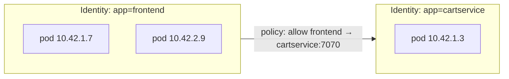

# ISOVALENT FEATURES — Essential to Advanced Activities

A hands-on lab guide for everything you can do with the **Isovalent Enterprise stack**
(Cilium + Hubble + Tetragon) on the cluster built by this repo (`isovalent-syd`,
`ap-southeast-2`). Work top to bottom, or jump to a feature.

> **Course map:** [Part 0 · Orientation](README.md) → [Part 1 · Build & Verify](FULL_DEPLOYMENT.md) → **Part 2 · Operate & Explore (this page)**
>
> You are in **Part 2**. This assumes you already completed **Part 1** and have a healthy
> cluster (`cilium status` all `OK`). If not, build it first with
> [FULL_DEPLOYMENT.md](FULL_DEPLOYMENT.md).

> Setup assumptions
> - `kubectl`, `cilium`, and `hubble` CLIs installed (`brew install cilium-cli hubble`).
> - The lab apps are deployed (`./lab/deploy.sh`): `boutique` namespace (Online Boutique)
>   and `default` namespace (Star Wars demo).
> - Run `cilium status` first — everything should be `OK`.
> - New to the stack? Build and verify the cluster with
>   [`FULL_DEPLOYMENT.md`](FULL_DEPLOYMENT.md) first — especially its
>   [Section 0 concepts primer](FULL_DEPLOYMENT.md#0-concepts-you-need-first).

---

## How to work through this guide

The labs are graded **Essential → Intermediate → Advanced**. Each builds on vocabulary from
the one before, so on a first pass go top to bottom. Most labs follow the same rhythm:

1. **Concept** — what the feature is and why it exists.
2. **Apply** — a small YAML or command you run.
3. **Observe** — watch the effect live in Hubble or Tetragon.
4. **Prove** — an allowed-vs-denied test that shows it actually working.

Before the labs, read [Section 0](#0-core-concepts-the-mental-model) once — it explains the
*identity* model and the eBPF datapath that make every policy below behave the way it does.

## Table of contents

**Foundations**
0. [Core concepts — the mental model](#0-core-concepts-the-mental-model)

**Essential**
1. [Observe traffic with Hubble](#1-observe-traffic-with-hubble)
2. [The Hubble UI service map](#2-the-hubble-ui-service-map)
3. [L3/L4 network policy](#3-l3l4-network-policy)
4. [L7 HTTP-aware policy](#4-l7-http-aware-policy)
5. [DNS / FQDN-based policy](#5-dns--fqdn-based-policy)

**Intermediate**
6. [Verify kube-proxy replacement & load balancing](#6-verify-kube-proxy-replacement--load-balancing)
7. [Verify WireGuard encryption](#7-verify-wireguard-encryption)
8. [Default-deny & cluster-wide policies](#8-default-deny--cluster-wide-policies)
9. [Host firewall](#9-host-firewall)
10. [Bandwidth manager (egress rate limiting)](#10-bandwidth-manager-egress-rate-limiting)
11. [Hubble metrics → Prometheus/Grafana](#11-hubble-metrics--prometheusgrafana)

**Advanced**
12. [Tetragon runtime observability](#12-tetragon-runtime-observability)
13. [Tetragon enforcement (kill on violation)](#13-tetragon-enforcement-kill-on-violation)
14. [Egress gateway (static egress IP)](#14-egress-gateway-static-egress-ip)
15. [ClusterMesh (multi-cluster)](#15-clustermesh-multi-cluster)
16. [Gateway API / Ingress with Cilium](#16-gateway-api--ingress-with-cilium)
17. [Mutual authentication (mTLS-style identity)](#17-mutual-authentication-mtls-style-identity)
18. [Export flows to OpenTelemetry / SIEM](#18-export-flows-to-opentelemetry--siem)

**Reference**
- [Glossary](#glossary)

---

# Foundations

## 0. Core concepts — the mental model

> **What you'll learn:** the three ideas that make every later lab "click" — how Cilium
> identifies workloads, where in the stack it enforces rules, and the difference between
> network policy (Cilium) and runtime policy (Tetragon).

### 0.1 Identities, not IP addresses

The single most important idea in Cilium: **policy is written against labels, not IPs.**

In a traditional firewall you allow `10.0.3.5 → 10.0.4.2:443`. But pods are ephemeral —
their IPs change every restart and reschedule, so IP rules rot instantly. Cilium instead
gives every set of identically-labelled pods a stable **security identity** derived from its
Kubernetes labels (e.g. `app=frontend`). When you write *"frontend may talk to
cartservice"*, Cilium enforces it no matter which node the pods land on or what IPs they get.



This is why, throughout these labs, policies select with `matchLabels` and you never type a
pod IP. It's also why Hubble shows you *names* (`frontend → cartservice`) instead of raw IPs.

### 0.2 Where enforcement happens: the eBPF datapath and L3–L7

Cilium attaches **eBPF** programs to each pod's virtual network interface inside the Linux
kernel. Every packet passes through them, so Cilium can allow/deny without a userspace proxy
for L3/L4. For L7 (HTTP, DNS, gRPC, Kafka) it transparently redirects the connection through
an **embedded Envoy** proxy — still no sidecars in your pods.

The "L" numbers refer to the OSI layer a rule inspects:

| Layer | Rule matches on | Example in these labs |
|-------|-----------------|------------------------|
| **L3** | Source/destination *identity* (labels) or CIDR | "only `frontend` may reach `cartservice`" |
| **L4** | + TCP/UDP port and protocol | "...on TCP **7070** only" (Lab 3) |
| **L7** | + application content (HTTP method/path, DNS name) | "...only `POST /v1/request-landing`" (Lab 4); "only `api.github.com`" (Lab 5) |

A plain firewall stops at L4 — it sees "TCP port 80" and can't tell a safe request from a
dangerous one on the *same* port. Cilium's L7 awareness is exactly what the Star Wars demo
(Lab 4) demonstrates.

### 0.3 Default-allow vs default-deny

By default, Kubernetes allows **all** pod-to-pod traffic. The moment you apply a
`CiliumNetworkPolicy` that *selects* a pod, that pod flips to **default-deny for the
direction(s) you specified** — only explicitly-allowed traffic gets through. This catches
everyone out once: applying an "allow frontend" ingress rule silently blocks every *other*
source. Labs 3, 4 and 8 lean on this behaviour deliberately; keep a Hubble `--verdict
DROPPED` stream open while you experiment.

### 0.4 Two kinds of policy: network vs runtime

This stack secures two different planes. Knowing which tool owns which keeps you from
reaching for the wrong one:

| | **Cilium** (network) | **Tetragon** (runtime) |
|---|----------------------|------------------------|
| Watches | Packets / connections between workloads | Processes, file access, syscalls *inside* a container |
| Policy object | `CiliumNetworkPolicy`, `CiliumClusterwideNetworkPolicy` | `TracingPolicy` |
| Question it answers | "Who may talk to whom, and how?" | "What is this process actually *doing* on the host?" |
| Can it block? | Yes — drop packets (L3–L7) | Yes — `SIGKILL` the process in-kernel (Lab 13) |
| You'll meet it in | Labs 1–11, 14–18 | Labs 12–13 |

Mnemonic: **Cilium guards the wire; Tetragon guards the box.** Together they give you
network *and* host telemetry from one eBPF foundation.

### 0.5 The objects you'll create

| Object (kind) | Scope | What it does |
|---------------|-------|--------------|
| `CiliumNetworkPolicy` (CNP) | One namespace | L3–L7 allow rules for selected pods |
| `CiliumClusterwideNetworkPolicy` (CCNP) | Whole cluster | Same, but applies across all namespaces (and to host endpoints) |
| `TracingPolicy` | Whole cluster | Tells Tetragon which kernel events to observe or enforce |

> **Check yourself:** (1) Why does Cilium use labels instead of IPs? (2) What does applying
> *any* ingress policy do to a pod's *other* inbound traffic? (3) Which tool would you use to
> block a process reading `/etc/shadow` — Cilium or Tetragon? If those are clear, you're
> ready for the labs.

---

# Essential

## 1. Observe traffic with Hubble

Start a port-forward to Hubble Relay, then stream flows:

```bash
$ cilium hubble port-forward &
$ hubble status                       # confirms relay connectivity
$ hubble observe --follow             # live cluster-wide flows
```

Useful filters:

```bash
# Only the boutique namespace
$ hubble observe --namespace boutique --follow

# Only dropped packets (great for debugging policy)
$ hubble observe --verdict DROPPED --follow

# Only L7 HTTP, with method/path/status
$ hubble observe --namespace boutique --protocol http --follow

# Traffic to/from a specific pod label
$ hubble observe --from-label app=frontend --to-label app=cartservice
```

Each line shows source → destination identity, L4/L7 detail, and the verdict
(`FORWARDED` / `DROPPED`). This is your primary debugging tool for every policy below.

## 2. The Hubble UI service map

```bash
$ cilium hubble ui      # opens http://localhost:12000 in your browser
```

Pick the `boutique` namespace to see a live **service dependency graph**. The built-in
load generator drives constant traffic, so edges light up in real time. Click an edge to
see the L3/L4/L7 flows behind it. This is the fastest way to understand an unfamiliar app.

## 3. L3/L4 network policy

Cilium policies use Kubernetes labels (identities), not IP addresses. Example: allow the
`frontend` to reach only `productcatalogservice` on TCP 3550 in the `boutique` namespace.

```yaml
# l4-frontend-to-catalog.yaml
apiVersion: cilium.io/v2
kind: CiliumNetworkPolicy
metadata:
  name: frontend-to-catalog
  namespace: boutique
spec:
  endpointSelector:
    matchLabels:
      app: productcatalogservice
  ingress:
    - fromEndpoints:
        - matchLabels:
            app: frontend
      toPorts:
        - ports:
            - port: "3550"
              protocol: TCP
```

```bash
$ kubectl apply -f l4-frontend-to-catalog.yaml
$ hubble observe --namespace boutique --to-label app=productcatalogservice --follow
# Traffic from frontend = FORWARDED; from anything else on 3550 = DROPPED
```

## 4. L7 HTTP-aware policy

This repo already ships one in `lab/starwars-l7-policy.yaml`. It allows only
`POST /v1/request-landing` to the deathstar:

```bash
$ XWING=$(kubectl get pod -l class=xwing -o jsonpath='{.items[0].metadata.name}')
$ kubectl exec "$XWING" -- curl -s -XPOST deathstar.default.svc.cluster.local/v1/request-landing
Ship landed
$ kubectl exec "$XWING" -- curl -s -XPUT deathstar.default.svc.cluster.local/v1/exhaust-port
Access denied
```

Watch the L7 verdicts live:

```bash
$ hubble observe --namespace default --protocol http --follow
# You'll see http-request/response with method, path, and DROPPED for the PUT
```

The L7 rules block live under `toPorts[].rules.http` (method + path, and you can also match
headers). Cilium's embedded Envoy enforces this — no sidecars.

## 5. DNS / FQDN-based policy

Allow a pod to reach only specific external domains, by DNS name. First permit DNS, then
the FQDN:

```yaml
# fqdn-allow-github.yaml
apiVersion: cilium.io/v2
kind: CiliumNetworkPolicy
metadata:
  name: allow-github-only
  namespace: default
spec:
  endpointSelector:
    matchLabels:
      class: xwing
  egress:
    - toEndpoints:
        - matchLabels:
            k8s:io.kubernetes.pod.namespace: kube-system
            k8s-app: kube-dns
      toPorts:
        - ports:
            - port: "53"
              protocol: UDP
          rules:
            dns:
              - matchPattern: "*"
    - toFQDNs:
        - matchName: "api.github.com"
      toPorts:
        - ports:
            - port: "443"
              protocol: TCP
```

```bash
$ kubectl apply -f fqdn-allow-github.yaml
$ kubectl exec "$XWING" -- curl -sS https://api.github.com -o /dev/null -w '%{http_code}\n'   # allowed
$ kubectl exec "$XWING" -- curl -sS https://example.com   -o /dev/null -w '%{http_code}\n'    # times out / DROPPED
$ hubble observe --from-label class=xwing --protocol dns --follow
```

---

# Intermediate

## 6. Verify kube-proxy replacement & load balancing

There is no `kube-proxy` DaemonSet — Cilium handles all Service routing (ClusterIP,
NodePort, LoadBalancer) in eBPF.

```bash
$ kubectl -n kube-system get ds | grep -c kube-proxy        # expect 0
$ kubectl -n kube-system exec ds/cilium -c cilium-agent -- cilium-dbg status | grep KubeProxyReplacement
KubeProxyReplacement:   True

# Inspect the eBPF service load-balancing table
$ kubectl -n kube-system exec ds/cilium -c cilium-agent -- cilium-dbg service list | head
```

Optional tuning (re-apply Helm values, not required for the lab):
- `loadBalancer.algorithm=maglev` — consistent hashing for even backend distribution.
- `loadBalancer.mode=dsr` — Direct Server Return preserves the client source IP.

## 7. Verify WireGuard encryption

Node-to-node traffic is transparently encrypted.

```bash
$ kubectl -n kube-system exec ds/cilium -c cilium-agent -- cilium-dbg status | grep -A2 Encryption
Encryption:   Wireguard   [NodeEncryption: Enabled, cilium_wg0 (Pubkey: ..., Peers: 1)]

# See the WireGuard interface and peer on a node
$ kubectl -n kube-system exec ds/cilium -c cilium-agent -- cilium-dbg encrypt status
```

Every packet leaving a node over the `cilium_wg0` interface is encrypted to the peer node.

## 8. Default-deny & cluster-wide policies

Lock down a namespace to default-deny, then allow only what you need. A *cluster-wide*
policy (`CiliumClusterwideNetworkPolicy`) applies to all namespaces at once.

```yaml
# default-deny-boutique.yaml — empty ingress/egress = deny all in this namespace
apiVersion: cilium.io/v2
kind: CiliumNetworkPolicy
metadata:
  name: default-deny
  namespace: boutique
spec:
  endpointSelector: {}
  ingress: []
  egress: []
```

```yaml
# cluster-allow-dns.yaml — let every pod resolve DNS, cluster-wide
apiVersion: cilium.io/v2
kind: CiliumClusterwideNetworkPolicy
metadata:
  name: allow-dns-everywhere
spec:
  endpointSelector: {}
  egress:
    - toEndpoints:
        - matchLabels:
            k8s:io.kubernetes.pod.namespace: kube-system
            k8s-app: kube-dns
      toPorts:
        - ports:
            - port: "53"
              protocol: UDP
```

```bash
$ kubectl apply -f cluster-allow-dns.yaml
$ kubectl apply -f default-deny-boutique.yaml
$ hubble observe --namespace boutique --verdict DROPPED --follow   # watch what breaks, then allow it
```

> Tip: build allow-rules incrementally while watching `DROPPED` flows in Hubble until the
> app works again. Remove `default-deny` to restore the lab.

## 9. Host firewall

Protect the *nodes themselves* (not just pods) with policies on the host network namespace.
Enable it via Helm (`hostFirewall.enabled=true`) then write a
`CiliumClusterwideNetworkPolicy` selecting `node-access` host endpoints. Example: allow only
SSH + Kubelet to nodes.

```yaml
apiVersion: cilium.io/v2
kind: CiliumClusterwideNetworkPolicy
metadata:
  name: host-firewall
spec:
  nodeSelector:
    matchLabels:
      kubernetes.io/os: linux
  ingress:
    - fromEntities: [remote-node, health]
    - toPorts:
        - ports:
            - port: "22"
              protocol: TCP
            - port: "10250"
              protocol: TCP
```

Verify host endpoints exist:

```bash
$ kubectl -n kube-system exec ds/cilium -c cilium-agent -- cilium-dbg endpoint list | grep -i host
```

## 10. Bandwidth manager (egress rate limiting)

Cilium can rate-limit a pod's egress with a simple annotation (requires
`bandwidthManager.enabled=true` in Helm values).

```bash
$ kubectl annotate pod "$XWING" kubernetes.io/egress-bandwidth=10M --overwrite
# Cilium enforces a 10 Mbit/s egress cap via eBPF/EDT — no tc shaping needed
```

## 11. Hubble metrics → Prometheus/Grafana

Hubble already exports OpenMetrics (enabled in `cilium/values.yaml.tftpl`). Scrape it:

```bash
# Hubble metrics endpoint inside the cluster
$ kubectl -n kube-system get svc hubble-metrics 2>/dev/null || \
  kubectl -n kube-system get ep -l k8s-app=hubble

# Quick install of kube-prometheus-stack and point it at Cilium/Hubble
$ helm repo add prometheus-community https://prometheus-community.github.io/helm-charts
$ helm install monitoring prometheus-community/kube-prometheus-stack -n monitoring --create-namespace
```

Cilium ships Grafana dashboards (Cilium Metrics, Hubble L7 HTTP, Network Policy) you can
import to visualize golden signals per service.

---

# Advanced

## 12. Tetragon runtime observability

Tetragon is already running with `lab/tetragon-tracingpolicy.yaml`. Watch process, file,
and network events as they happen:

```bash
$ kubectl -n kube-system exec -it ds/tetragon -c tetragon -- tetra getevents -o compact
```

Generate an event and see it captured:

```bash
$ FRONTEND=$(kubectl -n boutique get pod -l app=frontend -o jsonpath='{.items[0].metadata.name}')
$ kubectl -n boutique exec "$FRONTEND" -- cat /etc/passwd >/dev/null
# In the getevents stream you'll see a file access event for /etc/passwd
```

Write your own TracingPolicy to trace, say, every `sys_execve` in the `boutique` namespace,
or every connection to a sensitive port. The shipped policy already traces
`security_file_permission` on `/etc/passwd` and `/etc/shadow` plus `tcp_connect`.

## 13. Tetragon enforcement (kill on violation)

Tetragon can do more than observe — it can **block** by sending a `SIGKILL` in-kernel.
Add an `action: Sigkill` selector. Example: kill any process that opens `/etc/shadow`.

```yaml
# tetragon-block-shadow.yaml
apiVersion: cilium.io/v1alpha1
kind: TracingPolicy
metadata:
  name: block-shadow-access
spec:
  kprobes:
    - call: "security_file_permission"
      syscall: false
      args:
        - index: 0
          type: "file"
      selectors:
        - matchArgs:
            - index: 0
              operator: "Prefix"
              values: ["/etc/shadow"]
          matchActions:
            - action: Sigkill
```

```bash
$ kubectl apply -f tetragon-block-shadow.yaml
$ kubectl -n boutique exec "$FRONTEND" -- cat /etc/shadow      # process is killed in-kernel
command terminated with exit code 137
```

> Test enforcement policies carefully — `Sigkill` will terminate real workloads that match.

## 14. Egress gateway (static egress IP)

Route pod egress through a fixed node so external systems see a predictable source IP
(useful for allow-listing). Requires `egressGateway.enabled=true` in Helm values, then a
`CiliumEgressGatewayPolicy`:

```yaml
apiVersion: cilium.io/v2
kind: CiliumEgressGatewayPolicy
metadata:
  name: egress-via-gateway
spec:
  selectors:
    - podSelector:
        matchLabels:
          app: frontend
  destinationCIDRs:
    - "0.0.0.0/0"
  egressGateway:
    nodeSelector:
      matchLabels:
        kubernetes.io/hostname: <gateway-node>
    interface: eth0
```

All `frontend` egress now SNATs out of the chosen gateway node's IP.

## 15. ClusterMesh (multi-cluster)

The ClusterMesh API server is already enabled here (`cilium status` shows `ClusterMesh: OK`).
To connect a second Cilium cluster (e.g. another EKS), give each a unique `cluster.name` and
`cluster.id`, then:

```bash
# On both clusters (different kube-contexts)
$ cilium clustermesh enable --context <ctx-A>
$ cilium clustermesh enable --context <ctx-B>
$ cilium clustermesh connect --context <ctx-A> --destination-context <ctx-B>
$ cilium clustermesh status --context <ctx-A>

# Make a service available across clusters with a global annotation
$ kubectl annotate service my-svc service.cilium.io/global="true"
```

Pods can then reach `my-svc` in either cluster, with automatic failover and
load balancing across both.

## 16. Gateway API / Ingress with Cilium

Cilium can be your ingress/Gateway API controller (no separate ingress controller). Enable
`gatewayAPI.enabled=true` (and install the Gateway API CRDs), then:

```yaml
apiVersion: gateway.networking.k8s.io/v1
kind: Gateway
metadata:
  name: web
spec:
  gatewayClassName: cilium
  listeners:
    - name: http
      port: 80
      protocol: HTTP
---
apiVersion: gateway.networking.k8s.io/v1
kind: HTTPRoute
metadata:
  name: boutique
spec:
  parentRefs: [{ name: web }]
  rules:
    - matches: [{ path: { type: PathPrefix, value: / } }]
      backendRefs: [{ name: frontend, port: 80 }]
```

Cilium programs an AWS load balancer for the Gateway and routes L7 traffic to the boutique
frontend.

## 17. Mutual authentication (mTLS-style identity)

Cilium can enforce mutual authentication between workloads using SPIFFE identities, without
app changes or sidecars. Enable `authentication.mutual.spire.enabled=true`, then require it
in a policy:

```yaml
apiVersion: cilium.io/v2
kind: CiliumNetworkPolicy
metadata:
  name: require-mtls
  namespace: boutique
spec:
  endpointSelector:
    matchLabels:
      app: cartservice
  ingress:
    - fromEndpoints:
        - matchLabels:
            app: frontend
      authentication:
        mode: "required"
```

Only mutually-authenticated `frontend` workloads may reach `cartservice`.

## 18. Export flows to OpenTelemetry / SIEM

Stream Hubble flows out for long-term storage and correlation:

```bash
# Tail flows as JSON and forward anywhere (file, Kafka, OTel collector, SIEM)
$ hubble observe --follow -o json | your-shipper

# Or enable the Hubble exporter via Helm:
#   hubble.export.static.enabled=true
#   hubble.export.static.filePath=/var/run/cilium/hubble/events.log
```

Pair Tetragon's `tetra getevents -o json` with the same pipeline to get **network + runtime**
security telemetry in one place.

---

## Cleanup of experiments

Remove any policies you created during these labs:

```bash
$ kubectl delete ciliumnetworkpolicies --all -A
$ kubectl delete ciliumclusterwidenetworkpolicies --all
$ kubectl delete tracingpolicies --all          # keep the lab one if you still want it
```

Re-apply the shipped lab policies if needed:

```bash
$ kubectl apply -f lab/starwars-l7-policy.yaml
$ kubectl apply -f lab/tetragon-tracingpolicy.yaml
```

---

## Glossary

| Term | Definition |
|------|------------|
| **Identity** | A stable security ID Cilium derives from a workload's labels; policy is written against these, not IPs. |
| **Endpoint** | Cilium's term for a networked workload (usually a pod) it manages. |
| **CNP** | `CiliumNetworkPolicy` — namespaced L3–L7 allow rules. |
| **CCNP** | `CiliumClusterwideNetworkPolicy` — same, applied across all namespaces and host endpoints. |
| **L3 / L4 / L7** | OSI layers a rule inspects: identity/CIDR (L3), port/protocol (L4), application content like HTTP/DNS (L7). |
| **eBPF** | Sandboxed programs running in the Linux kernel; Cilium's and Tetragon's datapath. |
| **Envoy** | The proxy Cilium embeds to enforce L7 (HTTP/DNS/gRPC) rules — no app sidecars. |
| **Hubble** | Cilium's observability layer: live service map + searchable flow log. |
| **Hubble Relay** | Aggregates per-node Hubble data into one cluster-wide stream. |
| **Flow** | A single observed connection/packet event in Hubble, with verdict `FORWARDED` or `DROPPED`. |
| **Verdict** | Hubble's allow/deny result for a flow (`FORWARDED`, `DROPPED`). |
| **Default-deny** | The state a pod enters once any policy selects it: only explicitly-allowed traffic passes. |
| **FQDN policy** | A policy that allows egress to a DNS name (e.g. `api.github.com`) rather than an IP. |
| **kube-proxy replacement** | Cilium load-balancing Services in eBPF instead of the deleted `kube-proxy`/`iptables`. |
| **Maglev / DSR** | Optional LB tunings: consistent-hash backend selection; Direct Server Return preserves client source IP. |
| **WireGuard** | VPN protocol Cilium uses for transparent node-to-node encryption (`cilium_wg0`). |
| **Host firewall** | Cilium policy applied to the node's own host network namespace, not just pods. |
| **Bandwidth manager** | eBPF egress rate-limiting driven by a pod annotation. |
| **Tetragon** | eBPF runtime-security tool that observes (and can block) process/file/network events. |
| **TracingPolicy** | Tetragon CRD defining which kernel events (kprobes/syscalls) to watch or enforce. |
| **kprobe** | A kernel probe point Tetragon hooks to observe a function call (e.g. `security_file_permission`). |
| **SIGKILL action** | A Tetragon enforcement action that terminates a matching process in-kernel. |
| **Egress gateway** | Routes selected pods' outbound traffic through a fixed node so external systems see a predictable source IP. |
| **ClusterMesh** | Connects multiple Cilium clusters so Services can span and fail over across them. |
| **Global service** | A Service annotated `service.cilium.io/global="true"` so it's reachable across a ClusterMesh. |
| **Gateway API** | The modern Kubernetes ingress standard; Cilium can act as the controller (`gatewayClassName: cilium`). |
| **Mutual authentication** | Cilium-enforced workload identity (SPIFFE/SPIRE) added to a policy via `authentication.mode: required`. |
| **OpenMetrics** | The Prometheus-compatible metrics format Hubble exports for dashboards. |

---

### Where to go next

You've completed the course — Part 0 (orientation) → Part 1 (build & verify) → Part 2 (this
guide). When you're done experimenting, **tear the lab down to stop billing**:
[FULL_DEPLOYMENT.md › Teardown](FULL_DEPLOYMENT.md#11-teardown). It rebuilds in ~20 minutes
whenever you want it back.

Keep learning:
- Cilium docs: https://docs.cilium.io
- Tetragon docs: https://tetragon.io
- Isovalent labs (free, browser-based): https://isovalent.com/labs
