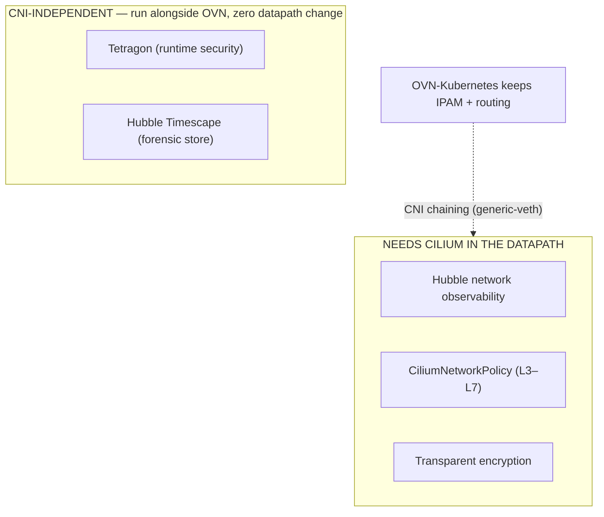

# OCP — Keeping OVN-Kubernetes: what Isovalent gives you *besides* Tetragon

A decision/architecture note for the case where the OpenShift owner **will not migrate the
CNI**. OVN-Kubernetes stays the datapath (no greenfield reinstall, no in-place migration —
see [`OCP_Only.md` Section M](OCP_Only.md) for those paths). The question this page answers:

> If we keep OVN-Kubernetes, **what value can Isovalent still deliver — beyond Tetragon?**

Short answer: more than people assume. The trick is knowing which capabilities are
**CNI-independent** (work no matter who owns the datapath) versus which need **Cilium in the
datapath** (and how to get that *without* replacing OVN, via CNI chaining).

---

## 1. The mental model — two classes of capability

- **CNI-independent** features hook into the **kernel via eBPF on syscalls/kprobes**, not on
  the pod network path. They do not care that OVN owns IPAM and routing. **Tetragon** is the
  headline here, but it is *not* the only one.
- **Datapath** features need Cilium's eBPF programs attached to the pod interfaces. You can
  get that **without migrating** by running Cilium in **CNI-chaining mode** — OVN keeps
  connectivity and IP management; Cilium *chains on top* to add visibility, policy and
  encryption.

---

## 2. Option A — Tetragon only (the baseline you already know)

Tetragon is fully CNI-agnostic. It installs as a DaemonSet, attaches eBPF to the kernel, and
gives you:

- **Runtime observability** — process execution, file access, network connections, privilege
  changes, capability use — with full process ancestry.
- **Runtime enforcement** — `SIGKILL` on policy violation (e.g. block a binary, a syscall, a
  write to `/etc`), independent of any network policy.
- **TracingPolicy** — kprobe/tracepoint/uprobe-based rules (see
  [`lab/tetragon-tracingpolicy.yaml`](../lab/tetragon-tracingpolicy.yaml)).

Nothing about OVN changes. This is the floor — everything below is *additional* value.

---

## 3. Option B — Add Cilium via **CNI chaining** (keep OVN, gain the datapath features)

This is the part most people miss. Cilium does **not** have to be the primary CNI to add
value. In **CNI-chaining mode**, the base CNI (here, OVN-Kubernetes) still does **IPAM and
routing**, and Cilium attaches eBPF programs to the veths OVN creates to layer on:

| Feature unlocked by chaining | What you get |
|---|---|
| **Hubble** | Flow-level network observability, the service map, L3–L7 visibility, DNS/HTTP metrics → Prometheus/Grafana |
| **CiliumNetworkPolicy / CCNP** | Identity-based L3/L4 **and L7** (HTTP, DNS/FQDN, gRPC, Kafka) policy on top of OVN's existing NetworkPolicy |
| **Transparent encryption** | WireGuard pod-to-pod encryption layered on the existing datapath |

> See the full hands-on catalogue of these features in
> [`ISOVALENT_FEATURES.md`](../ISOVALENT_FEATURES.md) — the *capabilities* are identical;
> only the install mode differs (chained vs. primary).

### 3.1 Important support caveat — read before promising this

Cilium publishes **certified** chaining integrations for AWS VPC CNI, Azure (legacy), Calico,
Generic-Veth, Portmap and Weave. **OVN-Kubernetes is not on that certified list.** Practically
that means:

- Chaining onto OVN-Kubernetes uses the **generic-veth** path and is **not a Red-Hat- or
  Isovalent-certified configuration on OCP**. Treat it as **unsupported / lab-only** unless
  both account teams confirm otherwise for your version.
- The **fully supported** OCP story for Cilium *network* features is still
  **Cilium-as-primary-CNI** (greenfield or migration — [`OCP_Only.md`](OCP_Only.md)).
- If the customer's hard constraint is "do not touch OVN," then the **supported** Isovalent
  value is **Tetragon (+ Timescape)**, and chaining is a **discussion to have**, not a default.

So: chaining is the technical answer to "more than Tetragon without migrating," but flag the
support status honestly.

---

## 4. Option C — Hubble Timescape for forensic history (CNI-independent for Tetragon)

[Hubble Timescape](OCP_Only.md) is the Enterprise historical store. It ingests **Tetragon**
process/security events even when Cilium is **not** in the datapath — giving you:

- **Retrospective forensics** — "what did this pod execute / connect to / write, last Tuesday?"
- Long-term retention and query of runtime events beyond the in-memory window.
- If you later add chaining (Option B), Timescape *also* ingests Hubble **network** flows —
  one pane for runtime + network history.

Requires the Isovalent Enterprise license/pull secret (same as the operator install in
[`OCP_Only.md`](OCP_Only.md)).

---

## 5. Decision summary

| Constraint | Recommended Isovalent footprint | Support status |
|---|---|---|
| "Do not touch OVN at all" | **Tetragon** + **Hubble Timescape** | Fully supported, CNI-independent |
| "Keep OVN but we want network visibility/policy too" | Above **+ Cilium CNI chaining (generic-veth)** for Hubble, CiliumNetworkPolicy, encryption | **Not certified on OCP/OVN** — lab/PoC; engage both account teams |
| "We can change the CNI" | **Cilium as primary CNI** (greenfield or migration) — full feature set | Fully supported — see [`OCP_Only.md`](OCP_Only.md) |

**Bottom line:** keeping OVN does **not** reduce Isovalent to Tetragon-only. Tetragon plus
Timescape already delivers runtime observability, enforcement and forensic history with zero
datapath change; CNI chaining can add Hubble, L3–L7 policy and encryption on top — with the
explicit caveat that OVN chaining on OCP is not a certified configuration today.

---

## 6. Related runbooks

- [`OCP_Only.md`](OCP_Only.md) — verification runbook + the two **supported** migration paths.
- [`ISOVALENT_FEATURES.md`](../ISOVALENT_FEATURES.md) — full feature lab (Hubble, policy,
  encryption, Tetragon, ClusterMesh, etc.).
- [`FULL_DEPLOYMENT.md`](../FULL_DEPLOYMENT.md) — build & verify reference.
